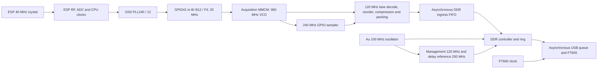

# Clock and bus synchronization

The ESP keeps its native 40 MHz crystal for RF performance. It forwards a
20 MHz hardware clock to the FPGA so the receiver can follow the CPU-driven
GPIO bus without drift. This replaces the original FPGA-to-XTAL_P reference,
which introduced enough LO phase noise to impair packet decoding.

## Wiring and settings

| Signal | ESP | Alchitry Br | FPGA |
|---|---|---|---|
| 20 MHz I2S0 MCLK | GPIO41, 10 mA drive | B12, SV2 pin 28 | F4, SRCC positive input |
| Clock return | GND, routed alongside MCLK | SV2 pin 19, GND | Common board ground |
| IQ data | Existing sixteen dedicated GPIO outputs, 10 mA | Existing C/D wiring | Existing sixteen inputs |

Use the [top-view wiring diagram](images/esp32s3-br-top-view.svg). Keep the
clock and its ground return short and together. SV2 pin 20 is +3.3 V, not ground.
The clock uses connector B; the data wiring uses C/D. Connector B also carries
FT600 signals, so this does not make it an otherwise quiet connector.

Remove the old Br B2 / FPGA D1 wire to the ESP's XTAL_P input and restore the
crystal series connection if it was removed. The FPGA no longer drives D1.
GPIO8 was used during bring-up but is not the clock output in this version.
Its downward header pin remains omitted: the underlying Br pad is +3.3 V.

The tested settings are I2S0 MCLK from **PLL240 / 12 = 20 MHz**, clock and data
pad drive **10 mA**, FPGA sampling phase **21**, existing per-line IDELAY taps
and rising-edge data sampling. GPIO17/18 use their special 10 mA drive encoding.
The sixteen data pins carry no added strobe; the I2S peripheral generates MCLK
without DMA, serial audio traffic or per-edge CPU work. Firmware also clears
the GPIO48 RGB LED during startup.

## Clock domains

Both acquisition clocks follow the ESP: 20 MHz × 48 gives a 960 MHz MMCM VCO,
then divide by 4 and 8 for 240 and 120 MHz. The sampler's fine phase has 224
positions per sample period, about 18.6 ps per step. The fixed instruction
schedule still determines which samples contain each data byte; the forwarded
clock prevents the sampling point from drifting.

Management and DDR remain clocked from the Au oscillator. The DDR ingress FIFO
crosses from the ESP-derived processing domain into the DDR UI domain. The
FT600 transmit side follows its own clock. Removing or reloading ESP firmware
therefore does not remove the clocks used for FPGA control and DDR refresh.

## Startup and faults

`iqstream load` holds the ESP in reset while it programs the FPGA. It waits for
management and DDR readiness, boots the ESP into its ROM loader and loads RAM
firmware. The ESP initializes the radio and starts MCLK. The host then waits
for valid forwarded frequency, acquisition MMCM lock, selected phase and input
delay calibration. Reloading only the ESP uses the same sequence with the
matching FPGA image already present.

The FPGA measures the forwarded frequency against the board oscillator. If it
loses that clock or acquisition MMCM lock during an open stream, it latches the
first fault and stops acquisition. The host fails the capture. A separate
200 MHz monitor counts sampled pulse-width anomalies, which also fail capture
validation. These checks supplement the link checksum, sequence, record CRC
and final sample-count checks; clock lock alone is insufficient.

A source-clock fault does not assert DDR reset. After the source returns, the
acquisition MMCM is explicitly reset and its phase is restored before another
run can arm. Management remains reachable throughout. Clock diagnostics are
shown by `iqstream status`; `FPGA_REFERENCE` is retired and cannot start an
output to XTAL_P.

## Validation

This wiring and clock configuration passed a 30-minute real-ADC run at 80 Msps
with zero integrity errors. The acceptance included final counts/CRC/END,
clock-lock faults and sampled pulse anomalies. The detailed bench artifacts
remain local. Synthetic pattern tests also checked data-bit integrity.

`tests/run.sh --long` exercises codec, link, control, clock loss/recovery,
reordering, DDR buffering and USB framing offline. Clock-domain tests use
functional clock/MIG models. For a different physical assembly, run
`iqstream calibrate`, check its passing window, and verify at the intended
sample rate; phase 21 is the setting for the tested wiring.
